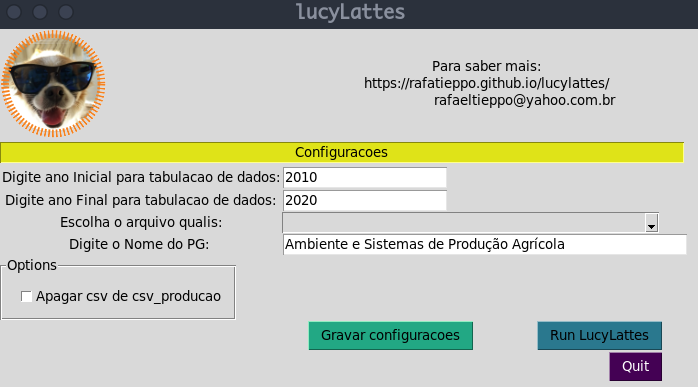

# lucyLattes

[](https://doi.org/10.5281/zenodo.2591748)

## Última atualização

- Versão v1.0.0
- *Sat 2024-05-23 18:34:23 -04* verifique os logs <a href="#logss">aqui</a>.

## Motivação

O CNPq por meio do currículo Lattes agrega dados do registro da vida profissional de estudantes, professores, e pesquisadores do país, e tornando-se padrão nacional no meio científico para consulta sobre a produção científica dos referidos profissionais.

Contudo, após a criação do captcha para o acesso aos currículos Lattes, extrair dados dos currículos se tornou uma tarefa árdua, pois todas vez que pretende-se acessar um currículo, torna-se necessário passar pelo captcha.  Com o intuito de auxiliar na obtenção destes dados, o `lucyLattes` foi desenvolvido.

Com o intuito de melhorar a extração dos dados, e reduzir a possibilidade de erros de execução, a **versão 2.0** foi desenvolvida. As principais mudanças estão na lógica de extração dos dados, organização dos arquivos e novos relatórios. 

## O que faz

Extração, compilação, e organização dos dados dos currículos da plataforma *Lattes* em arquivos de texto, e geração de um relátório simplificado, que proporcionam agilidade para a geração de informação.

Veja algumas informações geradas:

 <figure>
  
  <figcaption>Publicações de periódicos por ano</figcaption>
</figure> 

## Notas

> O lucyLattes não tem vínculo com o CNPq. Este programa computacional é fruto de um esforço (independente) realizado com o objetivo de dar suporte às rotinas de análise de dados cadastradas nos Currículos Lattes (publicamente disponíveis).

> Este programa é um software livre; você pode redistribui-lo e/ou modificá-lo dentro dos termos da Licença Pública Geral GNU. **Verifique** o arquivo **LICENSE.txt** .

>Este programa é distribuído na esperança que possa ser útil, mas SEM NENHUMA GARANTIA; sem uma garantia implicita de ADEQUAÇÂO a qualquer MERCADO ou APLICAÇÃO EM PARTICULAR. **Verifique** o arquivo **LICENSE.txt** .

## Como usar 

Inicialmente recomenda-se a leitura dos próximos tópicos (*Instalação* e *Como executar o programa*).

## Instalação

- Requerimentos:
    - Sistema operacional Linux ou com base Unix (preferencialmente), ou ainda Windows;
    - Python 3 ou superior;
    - Navegador (Firefox ou Chromium) para visualizar relatório.

### Python

- Se não possuir *Python3* ou superior instalado no *DEBIAN, UBUNTU ou derivados*:

```
sudo apt-get install python3
sudo apt-get install python3-pip
sudo apt-get install python3-tk
```

- Se não possuir *Python3* ou superior instalado no *Windows*

Acesse [https://python.org.br/instalacao-windows/](https://python.org.br/instalacao-windows/) e instale a versão do `Python 3`, basta seguir as instruções. **Não esqueça de instalar o PIP**.

Recomenda-se criar um ambiente virtual para instalar os pacotes e executar o `lucyLattes`.

### Ambiente virtual python (virtual environments)

Para saber mais sobre *ambiente virtual* em `Python`, clique aqui [https://docs.python.org/3/library/venv.html](https://docs.python.org/3/library/venv.html). Também fiz um post resumido sobre o assunto [AQUI](https://rafatieppo.github.io/post/2021_07_27_python_env/).

- De modo simplista, se vc usa `Linux`:

1. Crie uma pasta (diretório) e o ambiente virtual:

```
 mkdir teste_venv
 
 python3 -m venv ./teste_venv
 ```

2. Para ativar o ambiente virtual:

```
rt@rt-av52a:~/.virtualenvs$ source ./teste_venv/bin/activate

(teste_venv) rafatieppo@rt-av52a:~/.virtualenvs$ 
```

3. Para DEsativar o ambiente virtual:

```
(teste_venv) rafatieppo@rt-av52a:~/.virtualenvs$ deactivate
rafatieppo@rt-av52a:~/.virtualenvs$
```

- De modo simplista, se vc usa `Windows`:

1. Acesse o *Power Shell* como **Administrador** (botão direito) e libere a execução de *Scripts*. Se quiser saber mais [Microsot](https://answers.microsoft.com/pt-br/windows/forum/all/permitir-a-execu%C3%A7%C3%A3o-de-scripts-no/f6b195cf-0be7-46e2-b88c-358c79f78343)

No *Power Shell* digite:

```
Set-ExecutionPolicy Unrestricted
```

pressione `S` ou `Y`.

2. Asssumindo que o `Python` já esteja instalado, no *Power Shell* digite:

```
python -m venv nome_do_meu_ambiente_virtual
```

3. Ative seu ambiente virtual.

```
nome_do_meu_ambiente_virtual\Scripts\activate
```

Pronto, agora é só instalar as bibliotecas com o `pip` e posteriormente executar o `LucyLattes`.

4. Para desativar o ambiente virtual.

```
(nome_do_meu_ambiente_virtual)C:\Users\Joao\> deactivate
C:\Users\Joao\>
```

### Instale os pacotes

Para todos os sistemas operacionais (Linux, MacOS, Windows, Solaris, etc) são necesssários as mesmas bibliotecas. Para instalar as bibliotecas em ambientes Linux acesse o **Terminal**, ative o seu ambiente `Python` e instale os pacotes. Caso seja usuário `Windows`, acesse o `PowerShell`. 

Posteriormente, com o **ambiente virtual ATIVADO**, instale os pacotes necessários. No arquivo `requirements_lucyLattes.txt` está listado os pacotes necessários. Com o `pip` é possível executar o comando `pip install -r requirements_lucyLattes,txt` , e possivelmente os pacotes serão instalados. Ou ainda, vc pode instalar um pacote por vez.

```
(teste_venv) rt@rt-av52a:~/.virtualenvs$ pip3 install numpy
Collecting numpy
  Cache entry deserialization failed, entry ignored
  Downloading https://files.pythonhosted.org/packages/b8/46/40729c784/numpyx86_64.whl (14.1MB)
    100% |████████████████████████████████| 14.1MB 128kB/s 
Installing collected packages: numpy
Successfully installed numpy-1.21.1
(teste_venv) rafatieppo@rt-av52a:~/.virtualenvs$
```

## Como executar o programa

1. Faça o Download do arquivo `.zip` que contém o `lucyLattes`. 
Download aqui: [https://rafatieppo.github.io/lucylattes/](https://rafatieppo.github.io/lucylattes/). Escolha a opção `.zip` ou `.tar` para fazer o download dos aquivos.

2. Descompacte o arquivo `.zip` que em um diretório de sua preferência. 

3. Faça o dowload dos *curriculos Lattes* desejados e copie todos no diretório `xml_zip`. Para realizar o download dos *currículos Lattes*, acesse o *currículo Lattes* do pesquisador, e no canto superior direito clique sobre um botão `XML`, salve o arquivo e NÃO altere o nome e nem o formato, e *NÃO DESCOMPACTE OS ARQUIVOS*. O nome do arquivo é composto por *16* caracteres e a extensão `.zip`, e.g. `3275865819287843.zip`. 

4. Pelo terminal (ou power shell), e com o **ambiente virtual ATIVADO**, acesse o diretório descompactado, e digite:

- Se for em ambiente `Linux`:

`python3 app_lucyLattes.py`

- Se for em ambiente `Windows`

`python.exe app_lucyLattes.py` (ou algo similar)

7. Se tudo ocorreu corretamente, uma `interface` aparecerá:



Agora selecione as opções disponíveis, clique em `Gravar configurações`, e execute (`Run lucyLattes`). Se tudo ocorreu normalmente, há um relatório disponível na pasta `./relatorio` . Abra o arquivo `relatorio_producao.html` com o *Firefox* ou com o navegador da sua preferência. 

## Observações

<strike>
**Atenção**, **Atenção**, **Atenção**.
</strike>

## Gostou?

<p>Espero que o <code>lucyLattes</code> seja útil de alguma forma, dentro do possível estarei melhorando o script na sua funcionalidade.</p>
<p></p>

- Nos de uma estrela clicando na estrela no topo da página (lado direito)
- Caso queira, sinta-se livre para me pagar um cafézinho. Tudo que faço aqui é uma maneira de retribuir e compartilhar o conhecimento que adquiri ao longo da minha carreira, mas quem sou eu para negar um café, certo? Sua ajuda vai ser convertida para manter os scripts (pagando o provedor, por exemplo). O excedente, será utilizado para comprar café mesmo.

- via Paypal

<a href="https://www.paypal.com/cgi-bin/webscr?cmd=_s-xclick&hosted_button_id=68LAA9FZLABUQ" >  </a>

- via Pix


## Development

- TODO DANGER create a exceptio for NO papers found for reseacher.
- DONE read `zip` and return a `xml`;
- DONE create a minidom from `.xml`;
- DONE a function to return `.xml` encoding and version;
- DONE get dados-gerais and create a `csv` file for each researcher;
- DONE get research and extension projects with their respective participants, classification of the type of project (research or extension) by organizing the data into a `DataFrame` and export in a `csv` file for each researcher;
- DONE get published papers in **journal** by organizing the data into a `DataFrame` and export in a `csv` file for each researcher;
- DONE get published BOOKS organizing the data into a `DataFrame` and export in a `csv` file for each researcher;
- DONE get published CHAPTERS organizing the data into a `DataFrame` and export in a `csv` file for each researcher;
- DONE get advising for master, doc, pos-doc and others
- DONE get teaching courses for each institution
- DONE get short courses from others types of technical production
- DONE assign qualis and jcr for each paper;

- DONE Tidy data [100%]
  - [X] create algorithm to drop Titles by means cosine similarity
  - [X] tidy script data to join data from all researchers;
  - [X] tidy script to drop NaN, delete broked registers, etc

- TODO Running and config [100%]
  - [X] conditional to run or not index-h `getindex_hwebsci()`
  - [X] work on a GUI

- TODO Grapho for interactions among researchers [80%]
  - [X] interactions among researchers for papers;
  - [X] researchers with out interaction are listed;
  - [X] plot interaction
  - [X] Calcular o peso das interações dos membros no grafo;
  - [ ] Verificar as interações nos projetos de pesquisa e extensão;

- TODO Gerar índices utilizados pela CAPES para avaliação de PPG [0%]
  - [ ] Índice de Orientação (IndOri) 
  - [ ] Índice de discentes autores (IndAut)
  - [ ] Índice de produtos com autoria discente (IndDis)
  - [ ] Índice de Produtividade referente a artigos científicos do Programa (IndProdArt) 
  - [ ] Validação

- DONE Analyze H-index from WOS

- TODO Report `.html` [93%]
  - [X] setup file (`report_setup.py`) to report.py;
  - [X] list of researcher with city, state, linl lattes, update, orcid;
  - [X] list of research and extension projects;
  - [X] list of books and chapters;
  - [X] summary (by year) of the papers, books, chapters for researchers group;
  - [X] summary (by qualis) of the papers, books, chapters for researchers group;
  - [X] plot (year and qualis) of the papers, books, chapters for researchers group;
  - [X] summary of teaching, books, chapters by each researcher;
  - [X] summary of finished advising
  - [X] summary of running advising
  - [X] summary of papers by year and qualis
  - [X] summary for each researcher (papers, projects, advising)
  - [X] summary WOS
  - [X] improve the name files output for `hindex_websci_papers.csv` `hindex_websci_allgroup.csv` etc ... it is confuse.
  - [X] create a `support_report.py` file to decrease number of lines and improve the quality, maybe I should work with Classes.
  - [ ] create a function to fit yaxis in all plots

- DONE Remove files
  - `csv` files in folder `csv_producao`;
  - `csv` files in folder `csv_report`;
  
## Files

- `config.txt`: minimal configurations to run lucylattes, it is possible to assign period (year), qualis group, etc.
- `lucyLattes.py`: run all;
- `lucyLattes.py`: funciona como o executável;
- `./resources/read_set_config.py`: is a class to assing configurations;
- `./resources/getadv_minidom.py`: write a `.csv` with advising data from each `.xml`;
- `./resources/getadvrunning_minidom.py`: write a `.csv` with running advising data from each `.xml`;
- `./resources/getbooks_minidom.py`: write a `.csv` with books data from each `.xml`;
- `./resources/getchapters_minidom.py`: write a `.csv` with chapters data from each `.xml`;
- `./resources/getencoding_minidom`.py: return enconding and version from `.xml`;
- `./resources/getgeneraldata_minidom`.py: write a `.csv` with dados-gerais from each `.xml`;
- `./resources/getminidom_xmlfile`.py: return a minidom from each `.xml`;
- `./resources/getpapers_minidom.py`:  write a `.csv` with papers data from each `.xml`;
- `./resources/getresearchextproj_minidom`.py: write a `.csv` with research and extension projects from each `.xml`;
- `./resources/getshortcourses_minidom`.py: write a `.csv` with short courses from each `.xml`;
- `./resources/getteaching_minidom.py`: write a `.csv` with teaching courses from each `.xml`;
- `./resources/getworksevents.py`: to get all TRABALHOS-EM-EVENTOS;
- `./resources/grapho.py`: make a plot for interections among researchers;
- `./resources/index_capes.py`:  calcula os indicadores CAPES;
- `./resources/paper_jcr.py`: assign jcr score for each paper;
- `./resources/paper_qualispy`: assign qualis score for each paper;
- `./resources/read_list_from_txt.py`: read lines from a `txt` files and returns a `list`.
- `./resources/removefiles_csvproducao.py`: remove `csv` files in folders `./csv_producao/` `./csv_producao_hindex/`  `./relatorio/csv_report/` ;
- `./resources/report.py`: Write a report with plots and summaries;
- `./resources/report_class_filteryear.py`: a class to improve report_setup function, a filter for productions;
- `./resources/report_setup.py`: Analize procuctions file, create setup file, csv to generat report.
- `./resourcer/report_setup_dict`: create a dictionaru to aid in `report_setup.py`;
- `./resources/support_report_indexh.py`: functions to aid in index-h calculation;
- `./resources/support_report.py`: functions to aid in `report.py`
- `./resources/tidydata_csv.py`: 
    - this script tidy all csv into folder `csv_producao`;
    - there are several functions, each one for a kind of data (papers, ppe, ...);
    - it creates a file `xxxxxx_all.csv` with the same kind of data for all researchers (e.g. fullname_all.csv, papers_all.csv);
    - <s>it creates a file `xxxxxx_uniq.csv` with the same kind of data for all researchers, HOWEVER in this file there is NO duplicates. Thus a specific paper or project, etc, belongs for am unique reseacher. To assign the owner of the paper or project, etc, the authorship order is used.</s> See `./resources/tidydata_uniq_titles.py:`
    - from lucyLattes version 1.0, the script `verify.py` was emboided into `tidydata_csv.py`, it  drops rows with NaN values on field **YEAR**
        - function for general data;
        - function for research and extension projects;
        - functions for papers, books, chapters, advising, teaching.
- `./resources/tidydata_uniq_titles.py:`
    - working on file from `tidydata_csv.py`, it creates a file `xxxxxx_uniq.csv` with NO `TITLES` duplicates. Thus a specific paper or project, etc, belongs for am unique reseacher. To assign the owner of the paper or project, etc, the authorship order is used. The duplicates `TITLES` are dropped by mean cosine similarity.
- `./resources/unzip_xml.py`: - unzip `idlattes.zip` and return a `.xml`;

## Logs 
<a name="logss"></a> 

### Mon 2024-05-20 22:41:04 -04
- A simple `GUI` was implemented in the file `app_lucyLattes.py`. This `GUI` generates the file `./config_tk.txt` with the settings to run `lucyLattes.py`; Some changes were implemented in the
`class configSetup` (`read_set_config.py`); It was necessary to read the settings in `./config_tk.txt`. The file `config.txt` remains, but it is useless for now; The function `pg_name()` was changed as well, for now it gets PG's name from `./config_tk.txt`;

### Tue 2024-05-14 21:02:57 -04
- A new method to drop the duplicate `TITLES` has been implemented. This method is based on *cosine similarity* and this algorithm is in the file  `./resources/tidydata_uniq_titles.py:`

### Sat 2023-07-15 09:07:55 -04
- It was fixed a type error in `report_setup_dict.py`, in *grapho_papernoint* production, the function was change for columngrapho_noint. In `tidydata_csv.py` was created a new function to tidy *worksevents*. It was created a new file `getworksevents.py` to get all *TRABALHOS-EM-EVENTOS*.

### Thu 2022-06-16 16:23:55 -04
- The file `config.txt` is being read in `lucylattes.py`, and variables are assigned from the class `configSetup()`. It is done for *run indice capes*, *qualis file*, *wos*, *removefiles*. The frame.append method is deprecated and was replaced by pandas.concat.

### Thu 2022-04-14 18:46:34 -04
- a new function was implemented in `support_functions_indexh.py`, it makes a report of paper's citations for a specific year. Notice that this papers was published in this same year.

### Thu 2022-03-31 19:23:55 -04
- it was create a new function (`repot_setup_dict.py`) to create a dictionary with basic information to `report_setup.py`.

### Sat 2022-03-26 16:39:41 -04
- the class `report_class_filteryear.py` has been implemented. For a specific production, it finds a function to filter by years and generate a `csv` report file. This class is used into `report_setup.py`, which is cleaner than before.

### Wed 2022-03-09 18:53:58 -04
- in `report_setup.py` replace `if` by `case`, it is a better approach, for now its running. in `repor_setup.py` for running advising was implemented a fast lazy solution to solve the issue. It was because in running advising is not necessary to filter by year. The next steps are: to improve report layout, advisor and student interaction in papers.

### Sun 2022-03-06 11:02:51 -04
- report was improved, advising has been implemented (it was missing). Report aesthetics has been improved for a better visualization.

### Sun 2022-02-27 11:08:02 -04
- report is done. the output names for h index file has been improved. in the future, i should improve the code for report.py, for now its ok. 

### Sat 2022-02-26 18:08:39 -04
- individual summaries are done. minor fix in the code was implemented as follow: a new folder for hindex production; report for index h (unique) and group is NOT done. 

### Wed 2022-02-23 20:59:44 -04
- report group is done, individual summaries is incomplete. 

### Tue 2022-02-22 23:18:05 -04
- `report.py` has been started. a improvement was implemented to filter the projetcts. it is because may belong partially for a period.

### Mon 2022-02-21 07:15:14 -04
- report_setup.py was created. in this versions has been created a sub-folder in `relatorio` to store csv files used in `report.py`.

### Sat 2022-02-19 17:50:47 -04
- grapho is working well. the calculation weights by interactions among researchers is done.

### Wed 2022-02-17 20:32:51 -04
- new functions to improve tidy data; it was implemented into `tidydata_csv.py`; the main feature is to drop rows with empty values in **YEAR** field.

### Wed 2022-02-16 18:58:42 -04
- the script (`tidydata_csv`) for tidy and join all data in only one `csv` for each production is done. There are two kinds of joinned `csv`, `xxxxx_all.csv` and `xxxxx_uniq.csv`.

### Tue 2022-02-15 22:48:25 -04
- the papers were classified by qualis and jcr

### Tue 2022-02-15 20:48:58 -04
- Short courses was collected from xml file, and a `csv` is created. For all `csv` files a column with **ID** (id lattes) was add. It makes easir to manipulate data in the future. Otherwise, the `csv` file will be a little bit greater.

### Mon 2022-02-14 22:47:16 -04
- Advising for master, doc, pos-doc and other were collected from xml file, and a `csv` is created.

### Tue 2022-02-08 21:06:43 -04
- From papers published were add a new feature: from each author if there is the idCNPQ it is extracted. Data from books and chapters are alredy done.

### Wed 2022-02-02 18:59:00 -04
- Papers published in journal were collected from a xml file, and a `csv` is created. It is necessary add QUALIS and JCR

### Wed 2022-02-02 15:02:03 -04
- Extraction of the projects in the same year has been solved.

### Tue 2022-02-01 19:03:44 -04
- Research and extension projects were collected from xml file, and a `csv` is created. It is necessary to review a some extension projetcs wich start in the same year.

### Mon 2022-01-31 16:11:11 -04
- DADOS-GERAIS were collected from xml file, and a `csv` is created; A git repo has been created.

### Thu 2022-01-18 14:39:22 -04
- Version 2.0 has been started

## Referências

J. P. Mena-Chalco e R. M. Cesar-Jr. scriptLattes: *An open-source
knowledge extraction system from the Lattes platform*. Journal of the
Brazilian Computer Society, vol. 15, n. 4, páginas 31--39, 2009.

Rossum, G. van ( C. voor W. en I. (CWI)). (1995). *Python
tutorial*. Python (Vol. 206). Amsterdam. 

https://docs.python.org/pt-br/3/library/venv.html

https://docs.python.org/pt-br/3/tutorial/venv.html

## Autor

- Rafael Tieppo
- rafaeltieppo@yahoo.com.br
- https://rafatieppo.github.io/


## xml schemas


- general data

```
<CURRICULO-VITAE
    <DADOS-GERAIS
        <RESUMO-CV
        <ENDERECO
            <ENDERECO-PROFISSIONAL
        </ENDERECO>
    </DADOS-GERAIS>
```


- ppe
```
<CURRICULO-VITAE
    <ATUACOES-PROFISSIONAIS>
        <ATUACAO-PROFISSIONAL
            <ATIVIDADES-DE-PARTICIPACAO-EM-PROJETO>
                <PARTICIPACAO-EM-PROJETO
                    <PROJETO-DE-PESQUISA
                        <EQUIPE-DO-PROJETO>
                        </EQUIPE-DO-PROJETO>
                    </PROJETO-DE-PESQUISA>
                </PARTICIPACAO-EM-PROJETO>
            </ATIVIDADES-DE-PARTICIPACAO-EM-PROJETO>
        </ATUACAO-PROFISSIONAL>
    </ATUACOES-PROFISSIONAIS>
```

- books

```
<CURRICULO-VITAE
    <PRODUCAO-BIBLIOGRAFICA>
        <LIVROS-E-CAPITULOS>
            <LIVROS-PUBLICADOS-OU-ORGANIZADOS>
                <LIVRO-PUBLICADO-OU-ORGANIZADO>
                    <DADOS-BASICOS-DO-LIVRO />
                    <AUTORES />
                </LIVRO-PUBLICADO-OU-ORGANIZADO
            </LIVROS-PUBLICADOS-OU-ORGANIZADOS>
        </LIVROS-E-CAPITULOS
    </PRODUCAO-BIBLIOGRAFICA>
```

- chapters

```
<CURRICULO-VITAE
    <PRODUCAO-BIBLIOGRAFICA>
        <LIVROS-E-CAPITULOS>
            <CAPITULOS-DE-LIVROS-PUBLICADOS>
                <CAPITULO-DE-LIVRO-PUBLICADO>
                    <DADOS-BASICOS-DO-CAPITULO />
                    <AUTORES />
                </CAPITULO-DE-LIVRO-PUBLICADO
            </CAPITULOS-DE-LIVROS-PUBLICADOS>
        </LIVROS-E-CAPITULOS
    </PRODUCAO-BIBLIOGRAFICA>
```

- advising finished

```
<CURRICULO-VITAE
    <OUTRA-PRODUCAO>
        <ORIENTACOES-CONCLUIDAS>
            <ORIENTACOES-CONCLUIDAS-PARA-MESTRADO
            </ORIENTACOES-CONCLUIDAS-PARA-MESTRADO>
            <ORIENTACOES-CONCLUIDAS-PARA-DOUTORADO
            </ORIENTACOES-CONCLUIDAS-PARA-DOUTORADO>
            <ORIENTACOES-CONCLUIDAS-PARA-POS-DOUTORADO
            </ORIENTACOES-CONCLUIDAS-PARA-POS-DOUTORADO>
            <OUTRAS-ORIENTACOES-CONCLUIDAS
            </OUTRAS-ORIENTACOES-CONCLUIDAS>
        </ORIENTACOES-CONCLUIDAS
    </OUTRA-PRODUCAO>
```

- advising running

```
<CURRICULO-VITAE
    <DADOS-COMPLEMENTARES>
        <ORIENTACOES-EM-ANDAMENTO>
            <ORIENTACAO-EM-ANDAMENTO-DE-MESTRADO>
            </ORIENTACAO-EM-ANDAMENTO-DE-MESTRADO>
            <ORIENTACAO-EM-ANDAMENTO-DE-DOUTORADO>
            </ORIENTACAO-EM-ANDAMENTO-DE-DOUTORADO>
            <ORIENTACAO-EM-ANDAMENTO-DE-POS-DOUTORADO>
            </ORIENTACAO-EM-ANDAMENTO-DE-POS-DOUTORADO>
            <ORIENTACAO-EM-ANDAMENTO-DE-INICIACAO-CIENTIFICA>
            </ORIENTACAO-EM-ANDAMENTO-DE-INICIACAO-CIENTIFICA>
            <OUTRAS-ORIENTACOES-EM-ANDAMENTO>
            </OUTRAS-ORIENTACOES-EM-ANDAMENTO>
        </ORIENTACOES-EM-ANDAMENTO
    </DADOS-COMPLEMENTARES>
</CURRICULUM-VITAE>

```

- teaching

```
<CURRICULO-VITAE
    <ATUACOES-PROFISSIONAIS>
        <ATUACAO-PROFISSIONAL
            <ATIVIDADES-DE-ENSINO>
                <ENSINO
                    <DISCIPLINA
                    </DISCIPLINA>
                </ENSINO
            </ATIVIDADES-DE-ENSINO>
        </ATUACAO-PROFISSIONAL>
    </ATUACOES-PROFISSIONAIS>
```

- courses

```
<CURRICULO-VITAE
    <PRODUCAO-TECNICA>
        <DEMAIS-TIPOS-DE-PRODUCAO-TECNICA>
            <CURSO-DE-CURTA-DURACAO-MINISTRADO
            </CURSO-DE-CURTA-DURACAO-MINISTRADO>
        </DEMAIS-TIPOS-DE-PRODUCAO-TECNICA>
    </PRODUCAO-TECNICA>
```

- papers

```
<CURRICULO-VITAE
    <PRODUCAO-BIBLIOGRAFICA>
        <ARTIGOS-PUBLICADOS
            <ARTIGO-PUBLICADO>
                <DADOS-BASICOS-DO-ARTIGO />
                <AUTORES />
            </ARTIGO-PUBLICADO>
        </ARTIGOS-PUBLICADOS>
    </PRODUCAO-BIBLIOGRAFICA>
```

- worksevents

```
<CURRICULO-VITAE
    <PRODUCAO-BIBLIOGRAFICA>
        <TRABALHOS-EM-EVENTOS>
            <TRABALHO-EM-EVENTOS>
                <DADOS-BASICOS-DO-EVENTO />
            </TRABALHO-EM-EVENTOS>
                <AUTORES />
        </TRABALHOS-EM-EVENTOS>
    </PRODUCAO-BIBLIOGRAFICA>
```
